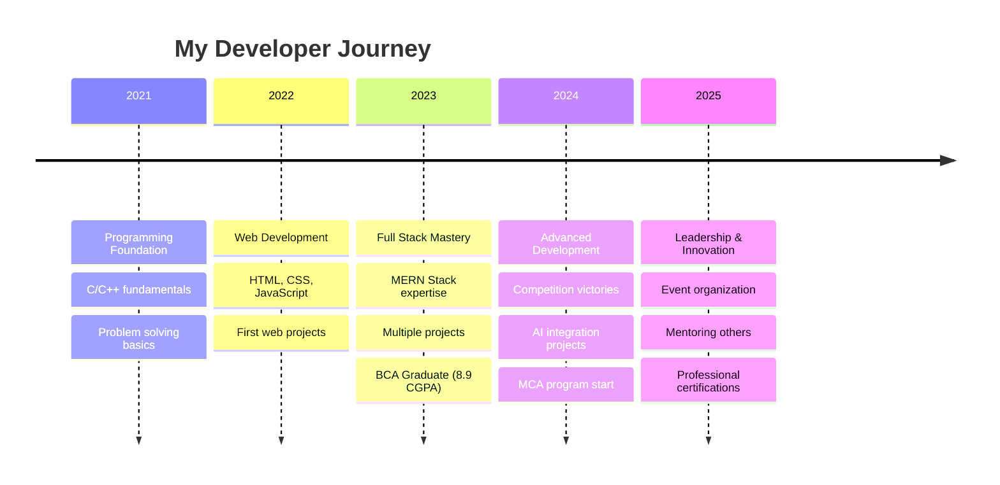

<div align="center">
  
  <!-- Animated Name Banner -->


</div>

<!-- Animated typing header -->
<div align="center">
  
  
  
  
  
</div>

---

## 🔥 About Me - The Developer Journey

<table>
<tr>
<td width="60%">

```json
{
  "developer": {
    "name": "Rahul Kulal",
    "role": "Full Stack Developer 🚀",
    "location": "Mangaluru, Karnataka, India 🇮🇳",
    "education": "MCA Student (SGPA: 8.6)",
    "email": "rahulkulala7@gmail.com",
    "passion": "Creating impactful web solutions ✨",
    "currentMission": "Mastering MERN stack development",
    "workingOn": [
      "🔥 Advanced React Applications",
      "🤖 AI-Powered Code Review Tools", 
      "🌍 E-commerce Platforms"
    ],
    "learning": [
      "Next.js & Advanced React 🚀",
      "System Design 🏗️",
      "Cloud Technologies ☁️"
    ],
    "achievements": [
      "🏆 Multiple 1st prizes in coding competitions",
      "🎯 450+ GeeksforGeeks problems solved",
      "⚡ 370+ LeetCode problems solved"
    ],
    "lifePhilosophy": "Code with passion, debug with patience",
    "superpower": "Turning coffee into clean, efficient code ☕"
  }
}
```

</td>
<td width="40%">

<div align="center">
  
</div>

</td>
</tr>
</table>

<details>
<summary><b>⚡ Quick Stats & Fun Facts</b></summary>
<br>

- 🔭 **Currently building:** AI-Powered Code Reviewer & Netflix Clone
- 🌱 **Learning:** Advanced System Design & Cloud Architecture
- 👯 **Collaboration:** Always open to exciting full-stack projects
- 🎯 **2025 Goal:** 1000+ DSA problems | Open source contributions
- ⚡ **Superpower:** Converting complex requirements to elegant solutions
- 🏆 **Recent Achievement:** 1st Prize in Joshiana 12.0 Coding Event
- 🌟 **Certifications:** HackerRank React Developer & JavaScript Intermediate
- 🎓 **Education:** MCA at Shree Devi Institute of Technology (Expected 2026)

</details>

---

## 🛠️ Tech Arsenal - My Digital Weapons

<div align="center">

### 🌟 My Core Skills


</div>

<br/>

<details>
<summary><b>💻 Detailed Tech Proficiency</b></summary>
<br/>

<table width="100%">
<tr>
<td width="50%">

**Frontend & Languages:**
```text
JavaScript/TypeScript ██████████ 96%
React.js/Next.js     ██████████ 94%
TailwindCSS          ████████▓▓ 88%
HTML/CSS             ██████████ 95%
C/C++ Programming    █████████▓ 90%
Java Development     ████████▓▓ 85%
Python Programming   ████████▓░ 82%
```

</td>
<td width="50%">

**Backend & Database:**
```text
Node.js/Express.js   █████████▓ 92%
MongoDB Database     ████████▓▓ 88%
MySQL Database       ████████░░ 80%
REST APIs            █████████▓ 90%
Git/GitHub           ████████▓▓ 88%
DSA & Problem Solving ██████████ 95%
Redux/State Mgmt     ████████▓░ 85%
```

</td>
</tr>
</table>

</details>

---

## 📊 GitHub Performance Dashboard

<div align="center">
  


</div>

<div align="center">
  
</div>

---

## 🏆 Achievement Showcase

<div align="center">
  
  
  
  
  <br/>
  
  
  

</div>

---

## 🎯 My Projects

<table width="100%">
<tr>
<td width="50%" valign="top" style="padding:10px;">
<div align="center" style="border: 1px solid #2d333b; border-radius: 10px; padding: 15px;">
<a href="https://github.com/Rahul-kulal-73/netflix_Clone" target="_blank">

</a>
<h3 align="center">🎬 Full-Stack Netflix Clone</h3>
<p align="center">A feature-rich streaming platform with JWT authentication, user profiles, and a dynamic video playback interface.</p>
<div align="center">
  
</div>
<br>
<div align="center">
  <a href="https://github.com/Rahul-kulal-73/netflix_Clone" target="_blank"></a>
</div>
</div>
</td>
<td width="50%" valign="top" style="padding:10px;">
<div align="center" style="border: 1px solid #2d333b; border-radius: 10px; padding: 15px;">
<a href="https://github.com/Rahul-kulal-73/AI_code_Review" target="_blank">

</a>
<h3 align="center">🤖 AI Code Reviewer</h3>
<p align="center">An intelligent tool that analyzes code snippets using the Google AI API to provide instant feedback and improvements.</p>
<div align="center">
  
</div>
<br>
<div align="center">
  <a href="https://github.com/Rahul-kulal-73/AI_code_Review" target="_blank"></a>
  <a href="https://ai-code-reviewer-alpha.vercel.app/" target="_blank"></a>
</div>
</div>
</td>
</tr>
</table>

---

## 💻 Competitive Programming Stats

<div align="center">
  
  
</div>

<br/>

## 🔥 LeetCode Achievements

<div align="center">
  
  
  ✨
  

</div>

<br/>

<div align="center">
  
  **🏆 Combined Achievements**
  <br/>
  <a href="https://leetcode.com/u/rahul-kulal/" target="_blank">
    
  </a>
  <a href="https://www.geeksforgeeks.org/user/rahulku169o/" target="_blank">
    
  </a>
  
  <br/>
  
  <a href="https://leetcode.com/u/rahul-kulal/" target="_blank">
    
  </a>
  <a href="https://www.geeksforgeeks.org/user/rahulku169o/" target="_blank">
    
  </a>

</div>


<br/>

<div align="center">
  
  <a href="https://leetcode.com/u/rahul-kulal/" target="_blank">
    
  </a>
  <a href="https://www.geeksforgeeks.org/user/rahulku169o/" target="_blank">
    
  </a>

</div>

---

## 🎯 Skill Matrix

<details>
<summary><b>📊 Click to see detailed skill breakdown</b></summary>
<br/>

<table width="100%">
<tr>
<td width="25%" align="center">

**💻 Frontend**


</td>
<td width="25%" align="center">

**🛠️ Backend**


</td>
<td width="25%" align="center">

**🗄️ Database**


</td>
<td width="25%" align="center">

**🎯 Languages**


</td>
</tr>
</table>

</details>

---

## 🌐 Connect With Me - Let's Build Together!

<div align="center">
  
  <a href="https://www.linkedin.com/in/rahul-kulal-bb30ba2b8/">
    
  </a>
  <a href="https://github.com/Rahul-kulal-73">
    
  </a>
  
  <br/><br/>
  
  <a href="mailto:rahulkulala7@gmail.com">
    
  </a>
  <a href="tel:+917353193714">
    
  </a>

</div>

---

## 💼 Professional Experience Timeline

<div align="center">
  


</div>

---

<div align="center">
  
  
  
  <br/>
  
  
  

</div>
